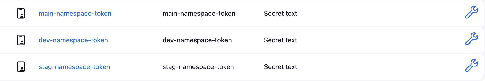
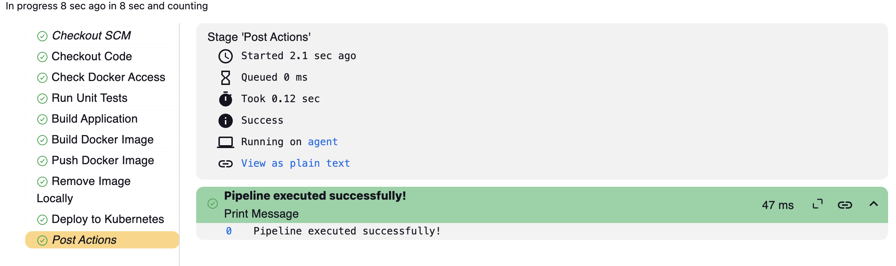

# 🚀 Multibranch Pipeline Setup
and this the link to the shared library:
https://github.com/Hager706/shared-library.git
## 1️⃣ Create Three Branches (main, stag, dev)
```sh
git switch -c dev  # 🌱 Create and switch to a new branch
git push -u origin dev  # 📤 Push the new branch
git switch -c stag
git push -u origin stag
git switch main  # 🔄 Return to the main branch
```

## 2️⃣ Create Namespaces
```sh
kubectl create namespace main
kubectl create namespace stag
kubectl create namespace dev
```

## 3️⃣ Create ServiceAccounts for Each Namespace
Create a ServiceAccount that Jenkins will use to interact with the Kubernetes API for deploying resources.
```sh
kubectl create serviceaccount jenkins-deployer -n main
kubectl create serviceaccount jenkins-deployer -n stag
kubectl create serviceaccount jenkins-deployer -n dev
```

## 4️⃣ Assign Roles to the ServiceAccounts
Create and apply a Role and RoleBinding for each namespace.
```sh
kubectl apply -f role-main.yaml
kubectl apply -f rolebinding-main.yaml

kubectl apply -f role-stag.yaml
kubectl apply -f rolebinding-stag.yaml

kubectl apply -f role-dev.yaml
kubectl apply -f rolebinding-dev.yaml
```

## 5️⃣ Get the Token for Each ServiceAccount 🔑
For each namespace, create a Secret and link it to the ServiceAccount.
```sh
# 🗂 Apply the Secret file
kubectl apply -f jenkins-deployer-secret-main.yaml

# 🔗 Link the Secret to the ServiceAccount
kubectl -n main patch serviceaccount jenkins-deployer -p '{"secrets": [{"name": "jenkins-deployer-token-main"}]}'

# 🔍 Extract Tokens for Each Namespace
kubectl -n main get secret jenkins-deployer-token-main -o jsonpath='{.data.token}' | base64 --decode
```
Repeat the above steps for `stag` and `dev` namespaces.

## 6️⃣ Add Tokens as Credentials in Jenkins 🔐
Jenkins needs these tokens to access Kubernetes.
1. Navigate to **Jenkins → Manage Jenkins → Manage Credentials**.
2. Click **Add Credentials**.
3. Choose **Secret text**.
4. Paste the token for the **main** namespace and give it an ID like `main-namespace-token`.
5. Repeat for `stag` and `dev` namespaces, using IDs like `stag-namespace-token` and `dev-namespace-token`.

 📸

## 7️⃣ Create a Jenkins Pipeline 🛠️
### Pipeline Steps:
1. **📥 Checkout Code**: Pulls the code from the GitHub repository.
2. **🐳 Build Docker Image**: Builds a Docker image of your app.
3. **📤 Push Docker Image**: Pushes the image to Docker Hub.
4. **🚀 Deploy to Kubernetes**: Deploys the app to the correct namespace (`main`, `stag`, or `dev`) based on the branch.

## 8️⃣ Use a Shared Library 📚
Utilize a shared library in Jenkins for reusable pipeline scripts and standardization.

## 9️⃣ Configure Jenkins Agent 🖥️
The agent must:
- ✅ Have `kubectl` installed.
- ✅ Have the `kubeconfig` file, which contains the cluster details and credentials.

### 📂 Copy the Kubeconfig File to the Agent:
On the **agent**:
```sh
mkdir -p ~/.kube 
chmod 700 ~/.kube
```

On the **master**:
```sh
chmod 600 ~/.kube/config
scp ~/.kube/config jenkins@192.168.105.11:~/.kube/config
scp -r ~/.minikube jenkins@192.168.105.11:~/
```

### ✅ Pipline run:

 📸

```

